# 🌀 Berkeley Networking Tracker

A private, deliberately psychedelic tracker for the people you want to stay connected with at Berkeley. Every contact you save — who they are, where you met, what you talked about, how urgently you should follow up — belongs to your account alone. That privacy is not a promise made by the user interface: it is enforced by Postgres row-level security policies attached to the table itself, so even a request made directly against the public data endpoint with a valid token can only ever reach the rows its owner created. The app is a separate React single-page frontend and a separate Node.js/Express API, backed by Neon Postgres with Managed Better Auth, deployed as two independent Vercel projects.

> **Live app:** <https://berkeley-networking-tracker.vercel.app>
> **API health check:** <https://berkeley-tracker-api.vercel.app/health>
> **Repository:** <https://github.com/ebright09/Pepe-Fundamentals-Assignment-2>

---

## Table of contents

- [Screenshots](#screenshots)
- [Features](#features)
- [Technology stack and why](#technology-stack-and-why)
- [Architecture](#architecture)
- [Database schema](#database-schema)
- [Authentication and RLS ownership](#authentication-and-rls-ownership)
- [Local setup](#local-setup)
- [Environment variables](#environment-variables)
- [Publishable versus secret keys](#publishable-versus-secret-keys)
- [Testing](#testing)
- [Deployment](#deployment)
- [Grading evidence](#grading-evidence)
- [Known limitations and what I would do next](#known-limitations-and-what-i-would-do-next)

---

## Screenshots

Every screenshot is captured from the **deployed** app by `npm run screenshots`
([`scripts/screenshots.mjs`](scripts/screenshots.mjs)), so they cannot drift from what the app
actually does. The create → refresh → edit → delete sequence below follows **one single contact**,
named with a timestamp so you can confirm it is the same record at every step.

### Sign in and sign out

| | |
|---|---|
| **Sign in** — the gate. Nothing else renders until you are authenticated. | **Signed out** — back to the gate, contacts gone from the page. |
| 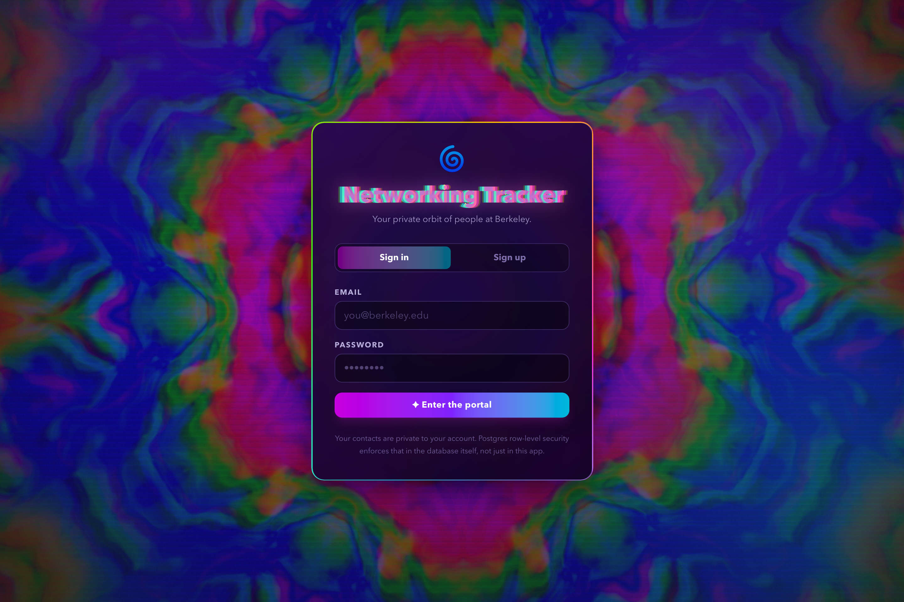 | 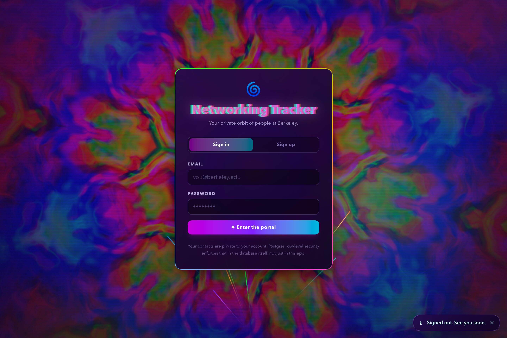 |

### Add, view, edit, delete — and it survives a refresh

**1 · Add.** The new-contact dialog, filled in.

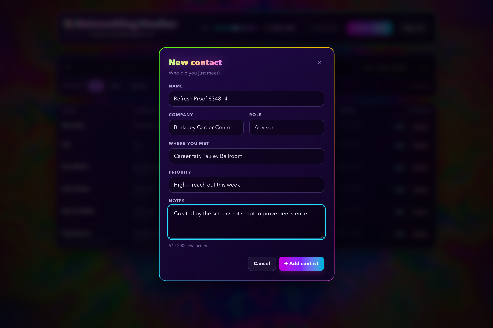

**2 · View.** `Refresh Proof 634814` is now in the list. (The name is timestamped at capture time, so
re-running the script produces a different number — but it is the same name across all six images.)

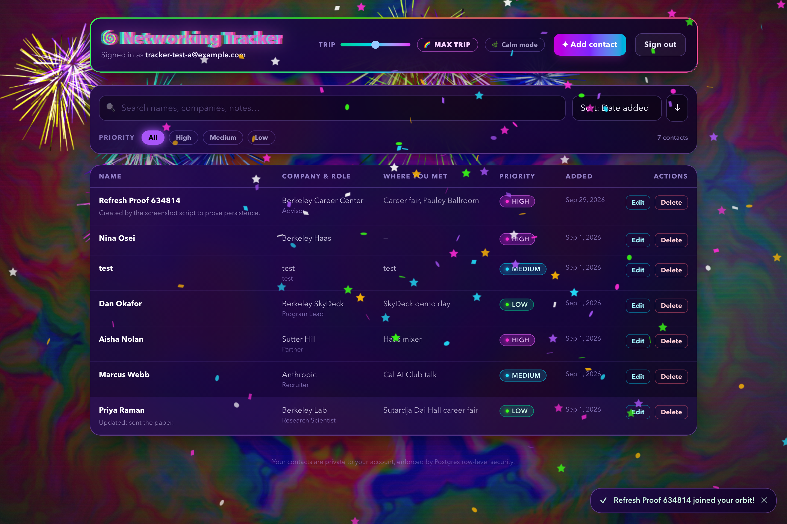

**3 · It survives a full page refresh.** Same contact, after `location.reload()` — it came back
from Postgres, not from anything held in the browser.

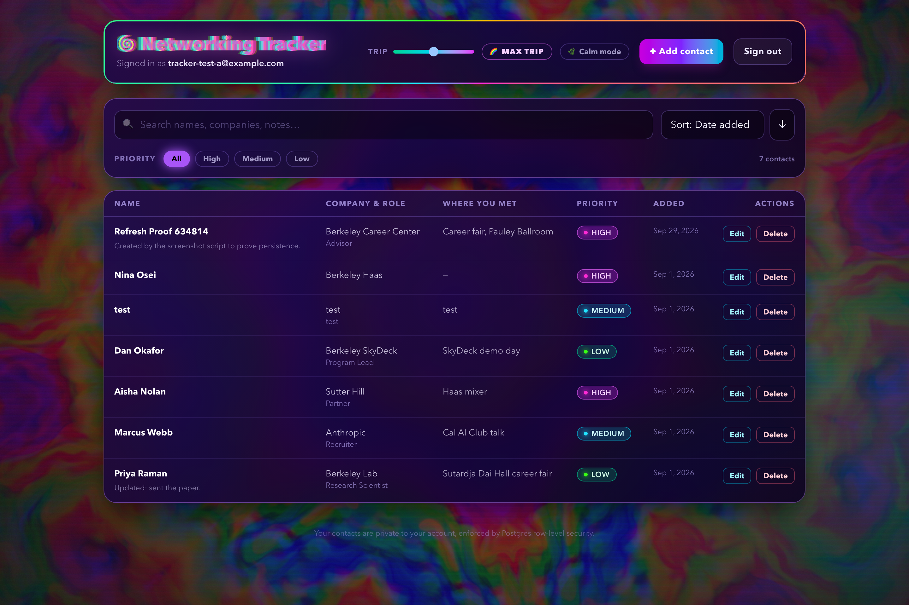

**4 · Edit.** The dialog opens pre-filled with the existing values.

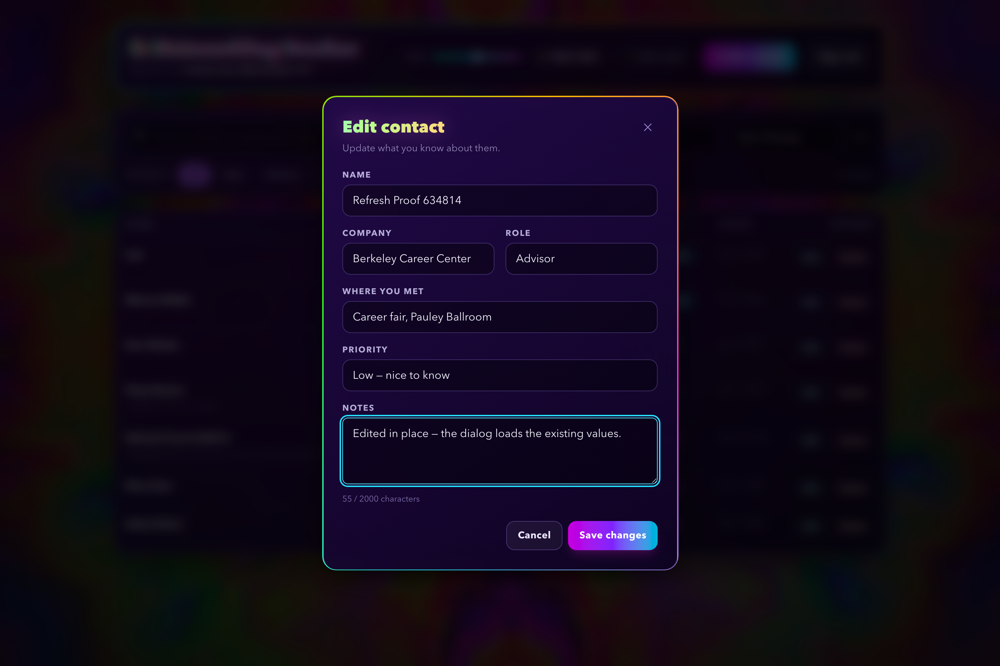

**5 · Delete.** Confirmation first, naming the exact contact.

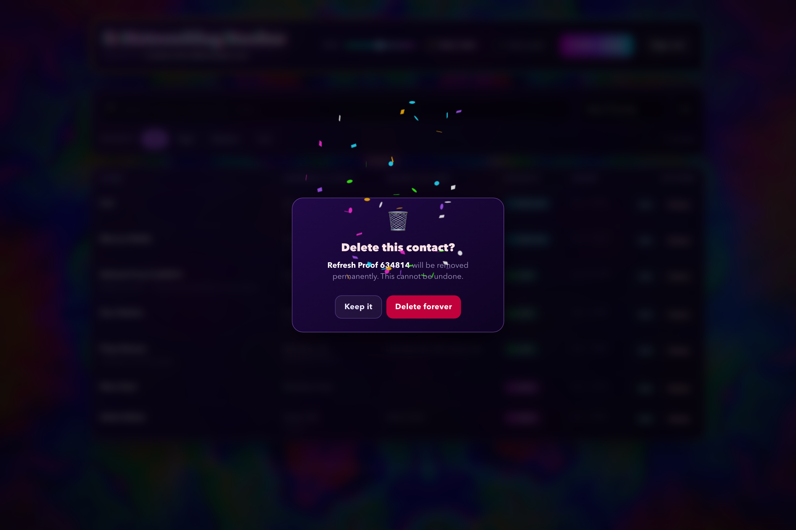

**6 · Deleted.** Gone from the list; the count drops by one.

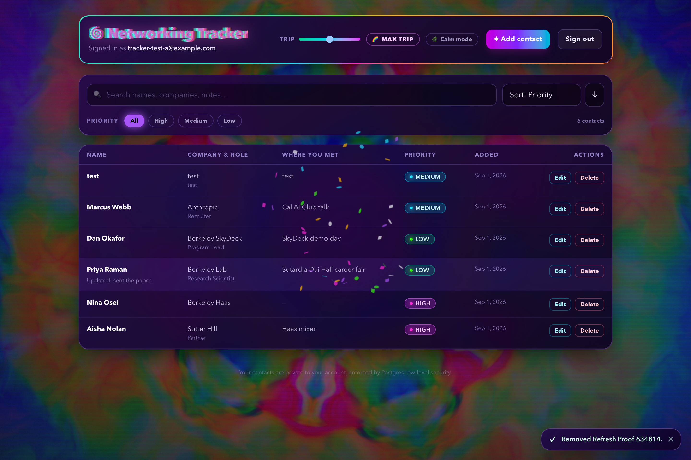

### Invalid input fails safely

A whitespace-only name is rejected **by the server** and the reason appears next to the field.

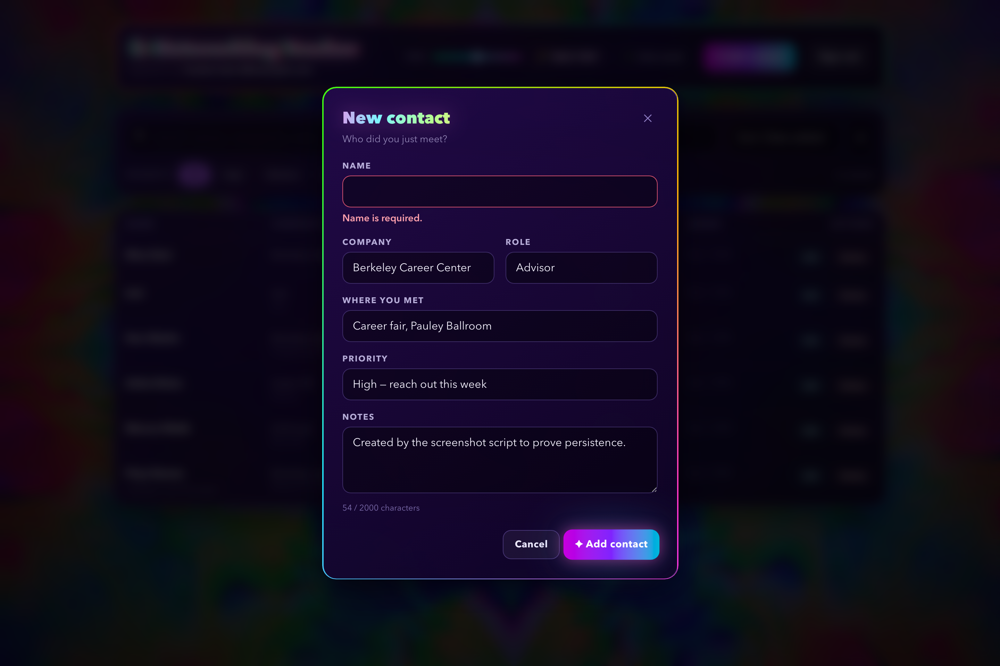

### Two-account privacy

User B signed in, seeing only their own contact. None of User A's rows appear anywhere.

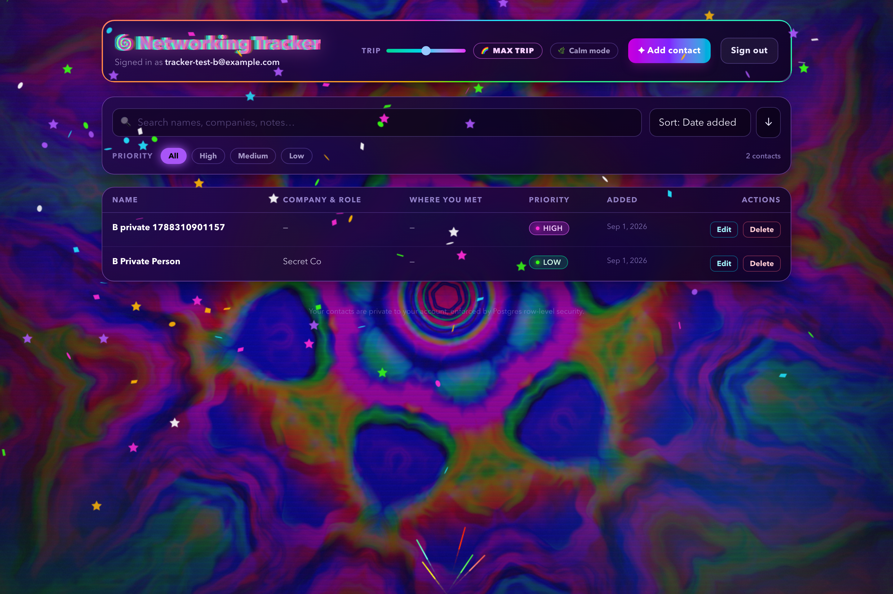

### The rest

| | |
|---|---|
| **The contact list** — sortable table, priority badges 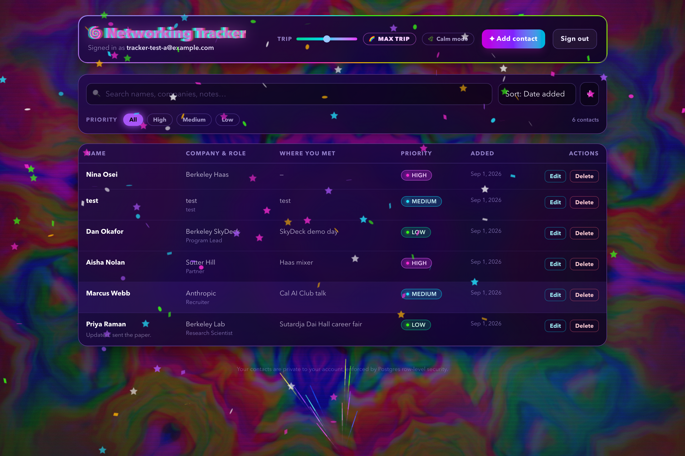 | **Sort and filter** — by priority, executed in Postgres 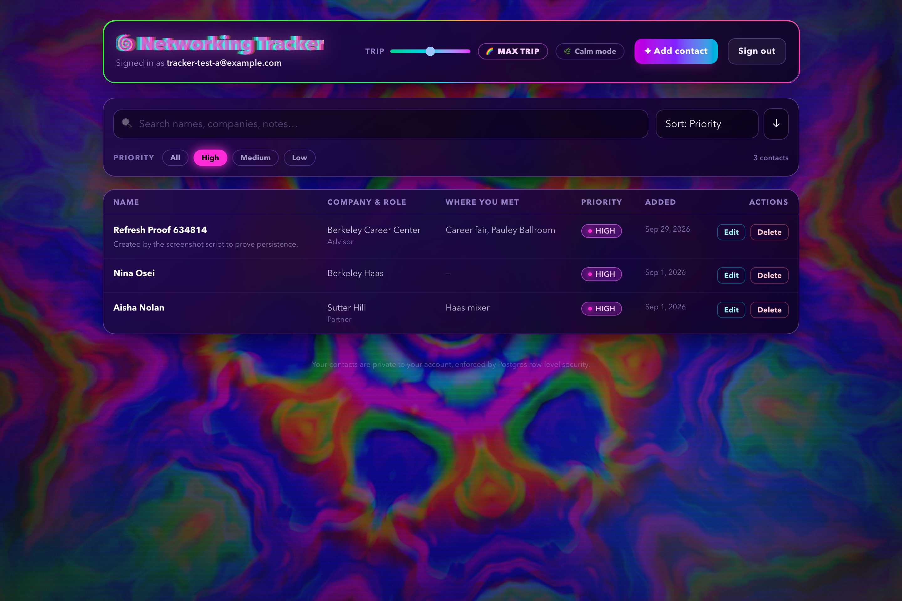 |

**Max trip / melt mode** — the intensity slider at 3. Kaleidoscope folding, rainbow scanlines,
prism-split text, continuous fireworks behind the glass. The table is still perfectly legible and
the priority colours still mean what they mean — that is the whole trick.

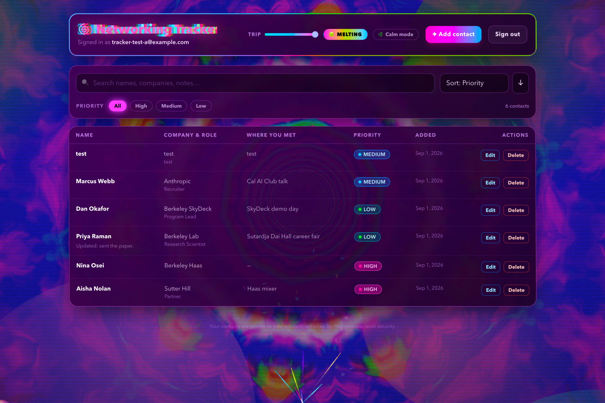

**Mobile (390px)** — the same data rendered as cards.

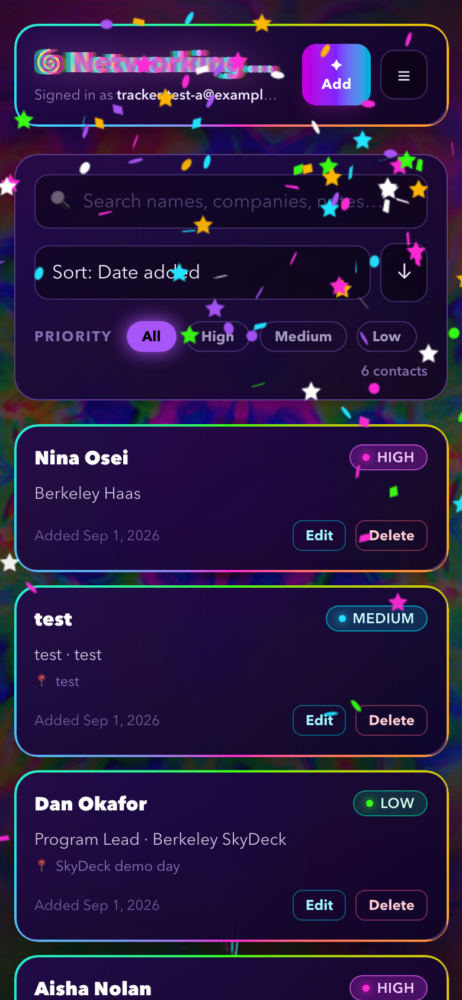

---

## Features

**Contacts**
- Sign up, sign in, and sign out with email and password
- Add a contact with **name, company, role, where you met, notes and priority**
- Priority is restricted to **high / medium / low** — in the form, in the API, and by a database `CHECK` constraint
- View contacts as a sortable table (desktop) or a card list (mobile)
- Edit and delete your own contacts, with a confirmation step before deletion
- **Sort** by date added, name, company, role, priority or last updated, ascending or descending
- **Filter** by priority and **search** across every text field — both executed in Postgres, not in the browser
- Data is stored in Neon Postgres, so it survives a refresh, a new tab, or a different device
- Distinct **loading, empty, success and error** states, each saying what happened and what to do next
- Responsive from a 375px phone to a wide desktop

**Visual effects**

A single full-screen fragment shader does most of the work. Fractal Brownian noise is
domain-warped twice, folded through a **kaleidoscope**, pushed down a rotating **tunnel**, and then
sampled three times at different offsets so red, green and blue separate the way they would through
a **prism**. On top of that:

- Drifting blurred colour blobs, animated film grain, and a conic animated border on every panel
- Holographic shimmering text with chromatic aberration, spring-physics motion, a hue-cycling cursor comet trail
- **Confetti** on every save — volume scales with the slider — plus a **bigger shower and fireworks** for a high-priority contact, and fireworks on sign-in
- **Trip intensity slider, 0 → 3.** Past 1.6 the app enters **melt mode**: rainbow VHS scanlines appear, the interface breathes and warps, borders spin faster, and the fireworks stop being an event and become the weather
- A **Max trip** button that slams everything to 3 at once
- **Calm mode** stops every animation dead, and turns itself on automatically for anyone whose system asks for reduced motion

Two deliberate constraints keep it usable at full tilt. The fireworks and scanlines render *behind*
the interface (`z-index` 5 and 6, with the UI at 10) rather than over it — painted on top they
simply erased the text. And melt mode's hue rotation **oscillates ±22°** instead of cycling a full
360°: a full rotation made every colour meaningless, so the priority badges all became the same
hue and the wordmark stopped being the wordmark.

---

## Technology stack and why

| Layer | Choice | Why |
|---|---|---|
| Frontend | **React 18 + Vite** | The assignment asks for a separate frontend. A Vite SPA builds to static files that Vercel serves from its edge, and it keeps the client genuinely independent of the API. |
| Styling | **Tailwind CSS v4 + Radix UI primitives** | Tailwind is the design system: one token set drives spacing, colour and type everywhere. Radix supplies the dialog primitives so focus trapping, escape-to-close and screen-reader semantics are correct rather than reinvented. |
| Animation | **Framer Motion**, `canvas-confetti`, `fireworks-js` | Spring physics for layout transitions; two small, focused libraries for the celebrations. |
| Backend | **Node.js + Express** | The assignment asks for a separate Node backend. Express deploys to Vercel as a single serverless function, so the same code runs locally and in production. |
| Validation | **Zod** | One schema defines the rule and generates the error message, so the API and the tests cannot drift apart. |
| Auth | **Neon Managed Better Auth** | Managed email/password auth whose JWTs Postgres already understands through `auth.user_id()`. |
| Data access | **Neon Data API** (PostgREST) | Lets the API act *as the signed-in user* instead of as a privileged database account, which is what makes RLS the real enforcement point. |
| Database | **Neon Postgres** | Row-level security, `CHECK` constraints and column defaults let the data model defend itself. |
| Hosting | **Vercel** (two projects) | Static frontend on the edge, API as a serverless function, each deployable on its own. |
| Tests | **Vitest + Supertest** | Fast, zero-config, and Supertest exercises the real Express app rather than a mock of it. |

---

## Architecture

```
┌────────────────────────────────────────────────────────────┐
│  Browser — React SPA        (Vercel project 1, static)     │
│                                                            │
│   @neondatabase/neon-js ──────────────► Neon Managed       │
│      sign up / sign in / sign out       Better Auth        │
│      ◄──────── session JWT (sub = user id) ────────        │
│                                                            │
│   fetch, Authorization: Bearer <jwt>                       │
└───────────────────────────┬────────────────────────────────┘
                            │
┌───────────────────────────▼────────────────────────────────┐
│  Node.js / Express API      (Vercel project 2, function)   │
│                                                            │
│   1. Verify the JWT signature against Neon's JWKS   (jose) │
│   2. Validate body and query parameters              (zod) │
│   3. Forward the SAME user JWT to the Data API             │
│                                                            │
│   Holds no service key and no DATABASE_URL.                │
└───────────────────────────┬────────────────────────────────┘
                            │  Authorization: Bearer <jwt>
┌───────────────────────────▼────────────────────────────────┐
│  Neon Data API (PostgREST)  ──►  Neon Postgres             │
│                                                            │
│   Row Level Security:  auth.user_id() = contacts.user_id   │
│   CHECK constraints:   priority ∈ {high, medium, low}      │
│                        name is non-blank, ≤ 120 chars      │
└────────────────────────────────────────────────────────────┘
```

### Request flow, end to end

Adding a contact travels like this:

1. The form collects the fields and does a quick client-side check purely so the user gets instant feedback.
2. `POST /api/contacts` goes to the Express API with the user's access token in the `Authorization` header.
3. `requireAuth` verifies that token's signature against Neon's published JWKS. An absent, expired or forged token is rejected with `401` before anything else runs.
4. `createContactSchema` parses the body. It is `.strict()`, so unknown keys — including an attempt to supply `user_id` — are rejected with `400` and a per-field message.
5. The API `POST`s the validated fields to the Data API, forwarding the user's own token. It never sends `user_id`.
6. Postgres fills `user_id` from the column default `auth.user_id()`, evaluates the `contacts_insert_own` policy's `WITH CHECK`, and enforces the `CHECK` constraints.
7. The created row comes back up the chain, the list refreshes, and confetti fires.

### Why the API proxies instead of connecting to Postgres directly

A conventional backend holds a privileged connection string and writes `WHERE user_id = $1` in every query. One forgotten clause and a user sees someone else's data.

This API holds no privileged credential at all. It passes the caller's own token through to the Data API, so Postgres evaluates the RLS policies for that specific user on every statement. Ownership is not something the application code has to remember — it is a property of the database. The cost is one extra network hop per request, which is a trade I would make again for this kind of data.

---

## Database schema

Defined in [`db/schema.sql`](db/schema.sql). Table `public.contacts`:

| Column | Type | Constraints | Notes |
|---|---|---|---|
| `id` | `uuid` | primary key, `default gen_random_uuid()` | |
| `user_id` | `text` | **`not null`, `default (auth.user_id())`** | The owner. Taken from the JWT `sub` claim by the database; never supplied by the client. |
| `name` | `text` | `not null`, `check (length(btrim(name)) between 1 and 120)` | `btrim` means a whitespace-only name is rejected, not just an empty string. |
| `company` | `text` | `check (length(company) <= 120)` | Optional. |
| `role` | `text` | `check (length(role) <= 120)` | Optional. |
| `met_at` | `text` | `check (length(met_at) <= 160)` | Where you met, e.g. "Sutardja Dai Hall career fair". |
| `notes` | `text` | `check (length(notes) <= 2000)` | Optional. |
| `priority` | `text` | `not null`, `default 'medium'`, `check (priority in ('high','medium','low'))` | The database is the final authority on valid priorities. |
| `created_at` | `timestamptz` | `not null default now()` | |
| `updated_at` | `timestamptz` | `not null default now()` | Maintained by a trigger. |

Also created: an index on `(user_id, created_at desc)`, and a `before update` trigger that refreshes `updated_at` **and re-pins `user_id` to its previous value**, so ownership cannot be changed by an update even in principle.

---

## Authentication and RLS ownership

**The ownership rule, in one line:** a request may touch a row only when `auth.user_id() = contacts.user_id`.

`auth.user_id()` is a function the Neon Data API provides. It returns the `sub` claim of the JWT presented with the current request, as text. Because the `user_id` column *defaults* to that value and is `NOT NULL`, every row is stamped with its real creator at insert time and no row can be ownerless.

RLS is enabled **and forced** on the table (`force row level security` applies the policies to the table owner too, so nothing quietly bypasses them), with four separate policies:

```sql
create policy contacts_select_own on public.contacts
  for select to authenticated
  using ((select auth.user_id()) = user_id);

create policy contacts_insert_own on public.contacts
  for insert to authenticated
  with check ((select auth.user_id()) = user_id);

create policy contacts_update_own on public.contacts
  for update to authenticated
  using ((select auth.user_id()) = user_id)     -- which rows you may target
  with check ((select auth.user_id()) = user_id); -- what they may look like after

create policy contacts_delete_own on public.contacts
  for delete to authenticated
  using ((select auth.user_id()) = user_id);
```

The `UPDATE` policy is the one worth reading twice. `USING` decides which rows the statement is allowed to see; `WITH CHECK` decides what those rows are allowed to become. Having both means a user can neither edit someone else's contact **nor re-assign one of their own contacts to another user** — the row after the update must still satisfy `auth.user_id() = user_id`, which can only be true if it still belongs to them.

Finally, `revoke all on public.contacts from anonymous` means an unauthenticated request is refused at the privilege layer, before RLS is even consulted.

**Why the public URLs are safe to ship in the frontend bundle.** `VITE_NEON_AUTH_URL` and `VITE_NEON_DATA_API_URL` are public HTTPS endpoints. Knowing them grants nothing: every request needs a signed JWT, and every row that JWT can reach is filtered by the policies above. The values that *must* stay secret — `DATABASE_URL` and any cookie secret — are used only by the one-off migration script and never appear in frontend code, in a `VITE_`-prefixed variable, or in Git.

---

## Local setup

**Prerequisites:** Node.js 20+, a Neon account.

```bash
git clone https://github.com/ebright09/Pepe-Fundamentals-Assignment-2.git
cd Pepe-Fundamentals-Assignment-2
npm install
```

### 1. Create the Neon project

1. Create a project at [console.neon.tech](https://console.neon.tech).
2. Open **Postgres database → Data API**, choose **Managed Better Auth**, and enable it.
3. Copy the two URLs Neon shows you: the **Auth URL** (ends in `/auth`) and the **Data API URL** (ends in `/rest/v1`).

### 2. Apply the schema

Open the **SQL Editor** in the Neon console, paste the contents of [`db/schema.sql`](db/schema.sql), and run it. This is the recommended route — your `DATABASE_URL` never has to leave the Neon console.

Verify it took effect:

```sql
select policyname, cmd from pg_policies where tablename = 'contacts' order by cmd;
```

You should see four policies: one each for `DELETE`, `INSERT`, `SELECT` and `UPDATE`.

### 3. Configure environment variables

```bash
cp .env.example backend/.env
cp frontend/.env.example frontend/.env.local
```

Fill in the two Neon URLs in both files. Neither file is tracked by Git.

### 4. Run it

```bash
npm run dev
```

The API starts on <http://localhost:8787> and the app on <http://localhost:5173>. To run them in separate terminals instead, use `npm run dev:backend` and `npm run dev:frontend`.

---

## Environment variables

The full annotated list is in [`.env.example`](.env.example), committed with placeholder values only.

**Public** (browser-visible; this is a Vite app, so the spec's `NEXT_PUBLIC_` prefix is `VITE_` here):

| Variable | Spec equivalent |
|---|---|
| `VITE_NEON_AUTH_URL` | `NEXT_PUBLIC_NEON_AUTH_URL` |
| `VITE_NEON_DATA_API_URL` | `NEXT_PUBLIC_NEON_DATA_API_URL` |
| `VITE_API_BASE_URL` | — (the URL of this project's own Node API) |

### Publishable versus secret keys

The distinction the rubric asks about, concretely:

| | Publishable | Secret |
|---|---|---|
| **Which values** | `VITE_NEON_AUTH_URL`, `VITE_NEON_DATA_API_URL`, `VITE_API_BASE_URL` | `DATABASE_URL`, `NEON_AUTH_COOKIE_SECRET` |
| **Where they live** | Vercel *frontend* project, type **Config**; compiled into the JS bundle | Nowhere in this app. `DATABASE_URL` is used by hand for migrations only and is **not set on either Vercel project** |
| **Who can read them** | Anyone who views source | Only me, locally |
| **Why that is safe / necessary** | They are public HTTPS endpoints. Holding the URL grants nothing: every request needs a JWT Neon signed, and RLS filters every row that JWT can reach | A connection string bypasses RLS entirely — it *is* the database. Exposing it would make every policy in `db/schema.sql` irrelevant |

Vercel actually enforces this distinction. Adding a `VITE_`-prefixed variable is refused unless you
declare it `--type config` ("expose publicly") rather than `--type secret`, precisely because the
prefix ships the value to the browser. All three public variables were added deliberately as
Config; no secret-typed variable exists on the frontend project.

Two further guarantees, both verified in [Live security verification](#live-security-verification):
the built frontend bundle contains no connection string, and no credential appears anywhere in Git
history.

**Server-only** — never committed, never exposed to the browser:

| Variable | Used by |
|---|---|
| `NEON_AUTH_BASE_URL` | API — deriving the JWKS endpoint |
| `NEON_AUTH_JWKS_URL` | API — optional explicit override |
| `NEON_DATA_API_URL` | API — where to forward validated requests |
| `ALLOWED_ORIGINS` | API — CORS allowlist |
| `DATABASE_URL` | **Migrations only.** Never read by the running app. |
| `NEON_AUTH_COOKIE_SECRET` | Reserved for a self-hosted Better Auth deployment |

`.gitignore` excludes `.env` and `.env.*` while explicitly keeping `.env.example`.

---

## Testing

```bash
npm test
```

Runs Vitest against the backend. **48 tests across 2 files, all passing.**

### What the automated tests verify

**`backend/tests/validation.test.js`** — the required validation test, 29 assertions covering:

- An empty name, a whitespace-only name (`"   "`), and a missing name are each rejected with the message **"Name is required."** — the value is trimmed *before* it is checked, so blank input cannot slip through
- A name over 120 characters is rejected
- All three valid priorities are accepted; `"urgent"`, `"HIGH"` and the number `3` are each rejected with **"Priority must be one of: high, medium, low."**
- Priority defaults to `medium` when omitted
- A body attempting to set `user_id` or `id` is rejected, and a valid parse never produces a `user_id` for the database layer to use
- A `PATCH` omitting a field leaves that column alone rather than nulling it, but an explicit `null` still clears it
- Unknown sort columns and invalid priority filters are rejected, so nothing arbitrary reaches the database

**`backend/tests/routes.test.js`** — 19 assertions over the real Express app via Supertest, with auth and the Data API stubbed:

- `401` for any unauthenticated request, and the data layer is never called
- The caller's own token is what gets forwarded to the data layer — the mechanism RLS depends on
- `400` with a field-level message for an empty name, an invalid priority, a malformed UUID or an empty update body
- `404` when a row is not the caller's — what RLS matching zero rows looks like from outside
- An unexpected internal error returns a generic `500` and does not leak connection strings or upstream detail

### The two-account privacy test

`backend/tests/rls.integration.test.js` runs against a **real Neon project** and deliberately bypasses this project's own API, calling the public Data API directly with two different users' tokens. The point is to prove that *Postgres* protects the rows, not that our server code remembers to filter them.

```bash
# create backend/tests/.env.test with two test accounts (gitignored), then:
npm run test:rls
```

It asserts that User A cannot **read**, **update** or **delete** User B's contact, that A's full listing never contains B's row, that A cannot re-assign one of their own rows to B, and that an unauthenticated request gets nothing at all.

---

## Deployment

Two Vercel projects from this one repository.

### Backend

1. **Add New → Project**, import this repository.
2. Set **Root Directory** to `backend`.
3. Add the server-only environment variables: `NEON_AUTH_BASE_URL`, `NEON_DATA_API_URL`, and `ALLOWED_ORIGINS` (the frontend's deployed URL). Do **not** add `DATABASE_URL`.
4. Deploy, then confirm `https://<api>.vercel.app/health` returns `{"ok":true}`.

### Frontend

1. **Add New → Project**, import the same repository again.
2. Set **Root Directory** to `frontend`.
3. Add `VITE_NEON_AUTH_URL`, `VITE_NEON_DATA_API_URL`, and `VITE_API_BASE_URL` (the backend URL from the previous step).
4. Deploy.

### Connect them

1. Set the backend's `ALLOWED_ORIGINS` to the frontend's deployed domain and redeploy the backend.
2. In the Neon console, add the frontend's deployed domain to **Auth → Trusted origins**. Neon
   rejects auth requests from any other origin with `403 INVALID_ORIGIN`, so sign-in will fail
   until this is done — it is the one step with no CLI equivalent.
3. Open the live URL in a private window, create two accounts, and run the checklist below.

### This project's deployment

| | |
|---|---|
| Frontend | `berkeley-networking-tracker` → <https://berkeley-networking-tracker.vercel.app> |
| Backend | `berkeley-tracker-api` → <https://berkeley-tracker-api.vercel.app> |
| Database | Neon project `ep-winter-night-afbzbnnf`, branch `production` |

Public (Config) variables on the frontend project: `VITE_NEON_AUTH_URL`, `VITE_NEON_DATA_API_URL`,
`VITE_API_BASE_URL`. Server-only variables on the backend project: `NEON_AUTH_BASE_URL`,
`NEON_AUTH_JWKS_URL`, `NEON_DATA_API_URL`, `ALLOWED_ORIGINS`. **`DATABASE_URL` is deliberately not
set on either Vercel project** — the running application has no use for it.

---

## Grading evidence

Each row of the assignment's Definition of Done, and where to find it.

| Check | Evidence |
|---|---|
| The app is **live** on a public URL | <https://berkeley-networking-tracker.vercel.app> — at the top of this README, with the API health check |
| A user can **sign in and sign out** | [Sign in and sign out](#sign-in-and-sign-out) — `01-sign-in.png`, `12-signed-out.png` |
| **Add, view, edit, delete** a contact and it **survives refresh** | [The six-step walkthrough](#add-view-edit-delete--and-it-survives-a-refresh) — `03-add-form` → `07-created` → `08-after-refresh` → `09-edit` → `10-delete-confirm` → `11-deleted`, all following the same contact |
| User A **cannot see or change** User B's contacts | [Two-account privacy](#two-account-privacy) (`05-two-accounts.png`), the [live security verification](#live-security-verification) table, and [`rls.integration.test.js`](backend/tests/rls.integration.test.js) — 7 assertions against the real database |
| One **invalid input fails safely** | [Invalid input fails safely](#invalid-input-fails-safely) — `04-invalid.png`, a whitespace-only name rejected by the server |
| At least one **automated test passes** | [Test output](#test-output) — 48 passing · [`validation.test.js`](backend/tests/validation.test.js) |
| Secret keys are in **server-only environment settings**, not frontend code | [Publishable versus secret keys](#publishable-versus-secret-keys) |
| You can explain the **schema and RLS ownership rule** | [Database schema](#database-schema) · [Authentication and RLS ownership](#authentication-and-rls-ownership) |

### Test output

```text
 RUN  v2.1.9  networking-tracker/backend

 ✓ tests/validation.test.js > createContactSchema — name is required > accepts a well-formed contact
 ✓ tests/validation.test.js > createContactSchema — name is required > rejects an empty name with a clear message
 ✓ tests/validation.test.js > createContactSchema — name is required > rejects a whitespace-only name — trimming happens before the check
 ✓ tests/validation.test.js > createContactSchema — name is required > rejects a missing name
 ✓ tests/validation.test.js > createContactSchema — name is required > rejects a name longer than 120 characters
 ✓ tests/validation.test.js > createContactSchema — priority accepts only high, medium or low > accepts "high"
 ✓ tests/validation.test.js > createContactSchema — priority accepts only high, medium or low > accepts "medium"
 ✓ tests/validation.test.js > createContactSchema — priority accepts only high, medium or low > accepts "low"
 ✓ tests/validation.test.js > createContactSchema — priority accepts only high, medium or low > rejects an out-of-range value with a clear message
 ✓ tests/validation.test.js > createContactSchema — ownership cannot be set by the client > rejects a body that tries to set user_id
 ✓ tests/routes.test.js > authentication > rejects an unauthenticated list request with 401
 ✓ tests/routes.test.js > authentication > forwards the caller's own token to the data layer, so RLS applies
 ✓ tests/routes.test.js > POST /api/contacts > rejects an empty name with 400 and a field-level message
 ✓ tests/routes.test.js > POST /api/contacts > rejects an invalid priority with 400 and a field-level message
 ✓ tests/routes.test.js > PATCH /api/contacts/:id > returns 404 when the row is not the caller's — RLS matched nothing
 ✓ tests/routes.test.js > error handling > does not leak internal detail when something unexpected throws
   … 32 more

 Test Files  2 passed (2)
      Tests  48 passed (48)
   Duration  717ms
```

### Live security verification

Beyond the unit tests, the following was run against the **real Neon project**. Every check
below bypasses this project's own API and talks to the public Data API directly, because the
claim being tested is that Postgres protects the rows — not that the server remembers to.

| Check | Result |
|---|---|
| Anonymous read of `/contacts` | `400 — missing authentication credentials` |
| Unauthenticated call to our API | `401 — You must be signed in to do that.` |
| Tampered JWT signature | rejected, not `200` |
| `user_id` stamped from `auth.user_id()` on insert | matches the token's `sub` |
| A lists all contacts | B's row absent |
| A requests B's row by exact id | `[]` |
| A updates B's row | `[]`, and B's row verified unchanged |
| A deletes B's row | `[]`, and B's row verified still present |
| A reassigns their own row to B | ownership unchanged (`WITH CHECK` + trigger) |
| Client supplies `user_id` on create | `400`, never forwarded to the database |
| Empty / whitespace name | `400 — Name is required.` |
| `priority: "urgent"` | `400 — Priority must be one of: high, medium, low.` |
| Search containing `,` `(` `)` `"` | `200` — filter values are quoted, not injected |

### Definition-of-done checklist

- [x] Live at a public URL
- [x] Sign up, sign in and sign out all work
- [x] Add, view, edit, delete, sort and filter contacts
- [x] Contacts survive a browser refresh
- [x] User A cannot see or change User B's contacts
- [x] An empty name and an invalid priority each fail with a clear message
- [x] `npm test` passes — 48 tests, plus 7 live RLS assertions via `npm run test:rls`
- [x] No `DATABASE_URL` or other secret in the frontend bundle or Git history

---

## Known limitations and what I would do next

- **Vercel serverless cold starts.** The first API request after a quiet period takes a second or two. A warm-up ping or Vercel's fluid compute would smooth it out.
- **`@neondatabase/neon-js` is at `0.7.0-beta`.** The auth wrapper in `frontend/src/auth.js` deliberately accepts more than one call shape (`signIn.email({...})` or `signIn({...})`, and several token accessors) so a minor SDK change does not break sign-in outright. Once the SDK is stable that indirection should go.
- **Frontend bundle is ~730 kB** (≈211 kB gzipped), mostly the auth SDK and the effects libraries. Route-level code splitting and lazily importing `fireworks-js` would cut the first paint considerably.
- **One extra network hop.** The API proxies the Data API rather than talking to Postgres directly. This is the deliberate trade described above — RLS stays the enforcement point — but it does add latency.
- **No pagination.** Every contact is fetched at once. Fine for a few hundred; a cursor over `(created_at, id)` would be the next step.
- **Email/password only.** No OAuth providers, no password reset flow, no email verification.
- **What I would build next:** follow-up reminders with a "last contacted" date and a nudge when a high-priority contact goes cold; tags; CSV import and export; and a proper end-to-end test with Playwright driving two real browser sessions to automate the two-account privacy check in CI.

---

Built for Assignment 1 — Secure Networking Tracker.
